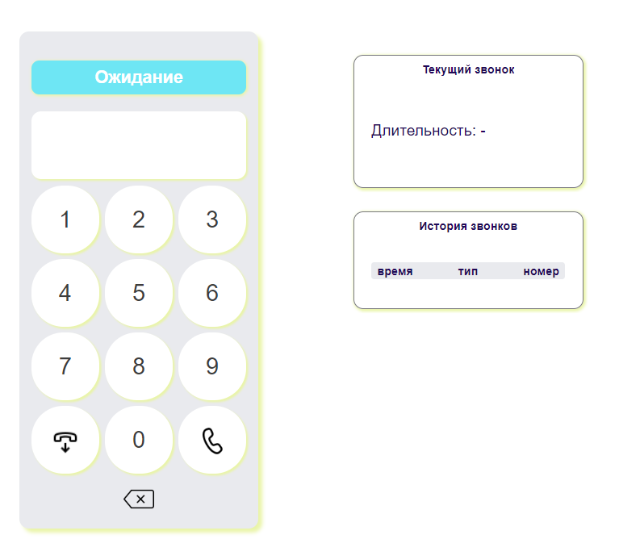

## Софтфон

Расширение для хром. Функционал:

- Регистрация пользователя на сервере SIP.
- Отображение текущего статуса звонка.
- Входящие и исходящие звонки.
- Сохранение истории звонков.
- Отображение информации о звонке.

## Start

```bash
git clone https://github.com/amoriah/ex02.git
cd ex01
```

- загрузить расширение в браузер
- ввести данные:
  1. Сервер: voip.uiscom.ru
  2. Логин: 0336443
  3. Пароль: fLkFmpFFm5

Для тестирования я использовала [3cx](https://www.uiscom.ru/podderzhka/nastrojka-oborudovanija/)

## Картиночки


